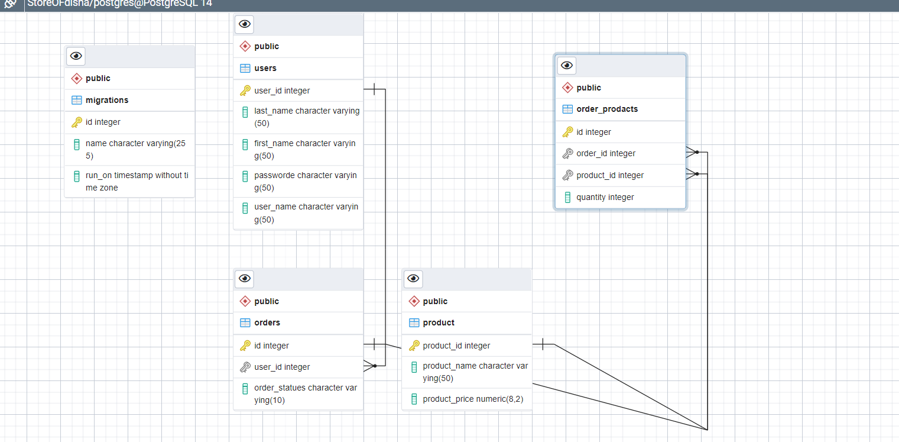

# DB Diagram



## DB-Schema

```sh
             List of relations
 Schema |      Name      | Type  |  Owner
--------+----------------+-------+----------
 public | migrations     | table | postgres
 public | order_prodacts | table | postgres
 public | orders         | table | postgres
 public | product        | table | postgres
 public | users          | table | postgres

```

## users tbl

```sh
                                         Table "public.users"
   Column   |          Type          | Collation | Nullable |                Default
------------+------------------------+-----------+----------+----------------------------------------
 user_id    | integer                |           | not null | nextval('users_user_id_seq'::regclass)
 last_name  | character varying(50)  |           | not null |
 first_name | character varying(50)  |           | not null |
 passworde  | character varying(255) |           | not null |
 user_name  | character varying(50)  |           | not null |
Indexes:
    "users_pkey" PRIMARY KEY, btree (user_id)
Referenced by:
    TABLE "orders" CONSTRAINT "orders_user_id_fkey" FOREIGN KEY (user_id) REFERENCES users(user_id)

```

## products Table

```sh


                                           Table "public.product"
    Column     |         Type          | Collation | Nullable |                   Default
---------------+-----------------------+-----------+----------+---------------------------------------------
 product_id    | integer               |           | not null | nextval('product_product_id_seq'::regclass)
 product_name  | character varying(50) |           | not null |
 product_price | numeric(8,2)          |           | not null |
Indexes:
    "product_pkey" PRIMARY KEY, btree (product_id)
Referenced by:
    TABLE "order_prodacts" CONSTRAINT "order_prodacts_product_id_fkey" FOREIGN KEY (product_id) REFERENCES product(product_id)
```

## orders Table

```sh
                                       Table "public.orders"
    Column     |         Type          | Collation | Nullable |              Default
---------------+-----------------------+-----------+----------+------------------------------------
 id            | integer               |           | not null | nextval('orders_id_seq'::regclass)
 user_id       | integer               |           |          |
 order_statues | character varying(10) |           |          |
Indexes:
    "orders_pkey" PRIMARY KEY, btree (id)
Foreign-key constraints:
    "orders_user_id_fkey" FOREIGN KEY (user_id) REFERENCES users(user_id)
Referenced by:
    TABLE "order_prodacts" CONSTRAINT "order_prodacts_order_id_fkey" FOREIGN KEY (order_id) REFERENCES orders(id)

```

## order_prodacts Table

```sh
                                 Table "public.order_prodacts"
   Column   |  Type   | Collation | Nullable |                  Default
------------+---------+-----------+----------+--------------------------------------------
 id         | integer |           | not null | nextval('order_prodacts_id_seq'::regclass)
 order_id   | integer |           |          |
 product_id | integer |           |          |
 quantity   | integer |           |          |
Indexes:
    "order_prodacts_pkey" PRIMARY KEY, btree (id)
Foreign-key constraints:
    "order_prodacts_order_id_fkey" FOREIGN KEY (order_id) REFERENCES orders(id)
    "order_prodacts_product_id_fkey" FOREIGN KEY (product_id) REFERENCES product(product_id)
```
